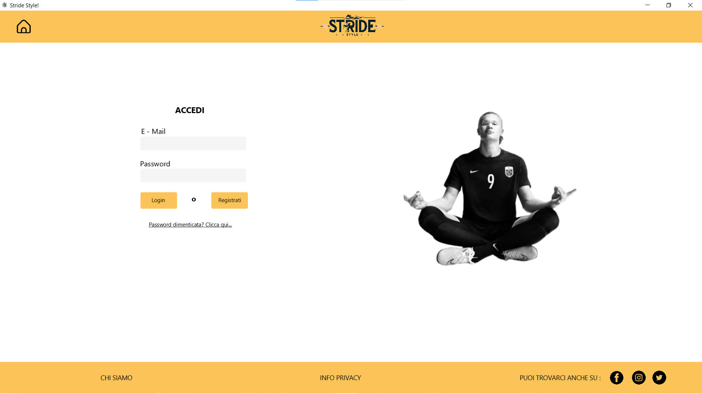
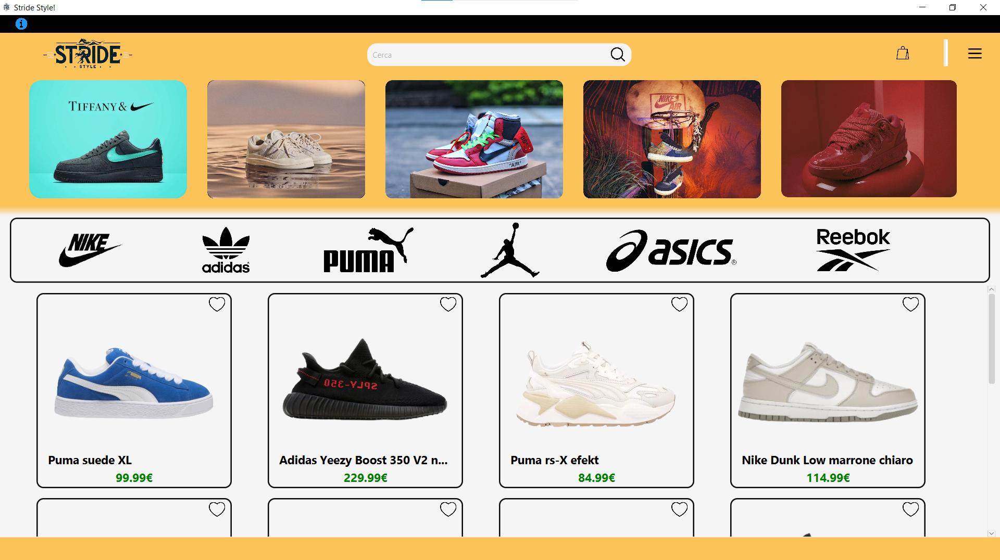
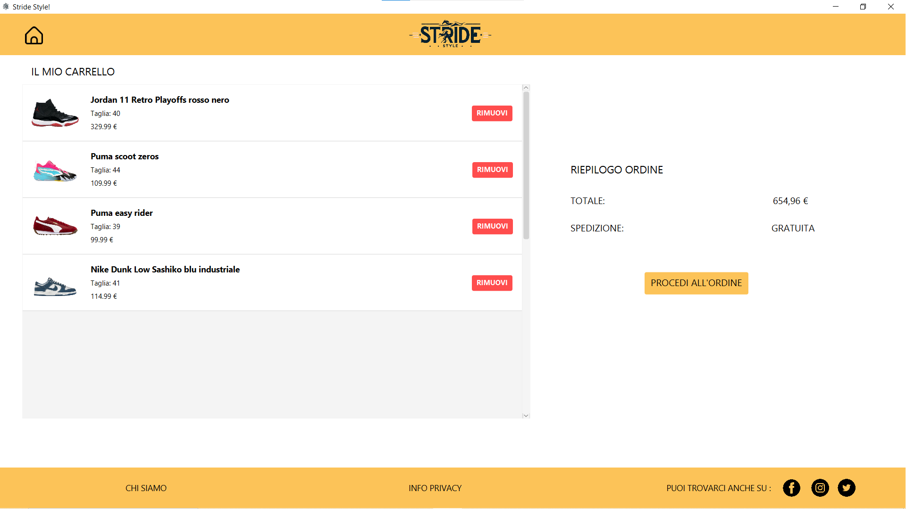

# 🛒 E-Commerce Desktop Application – Full Stack Java Project


> **🇮🇹 Italian version available here → [Leggi in Italiano](./README_IT.md)**

## 🌟 Overview

This project is a **full-stack desktop e-commerce application** built using **JavaFX (frontend)** and **Spring Boot REST APIs (backend)**.

The application simulates a real-world online shoe store and allows users to browse products, manage a shopping cart, and perform checkout operations through a client-server architecture.

The main goal of this project was to design a scalable and maintainable software system following industry best practices such as layered architecture, asynchronous UI operations, and RESTful communication.

---

## Screenshots

| **Login & Auth** | **Product Catalog** |
|:---:|:---:|
|  |  |

| **Shopping Cart** |
|:---:|:---:|
|  |

---

## How to Run

To run this application, you need to start both the **Backend Server** and the **Frontend Client**.

### Prerequisites
* **Java JDK 21** installed.
* **Maven** (optional, wrapper is included).

### Step 1: Start the Backend
Open a terminal in the `Backend` folder and run:
```bash
# Windows
./mvnw spring-boot:run

# Mac/Linux
./mvnw spring-boot:run

### Step 2: Start the Frontend
# Windows
./mvnw javafx:run

# Mac/Linux
./mvnw javafx:run

##  Architecture

The application follows a layered architecture both on frontend and backend.

### Backend – Spring Boot

- Controller Layer → REST endpoints  
- Service Layer → Business logic  
- Repository Layer → Data access via JPA/Hibernate  
- Model Layer → Entity mapping  

### Frontend – JavaFX

- Controller → UI handling  
- Service Layer → API communication  
- ApiClient → HTTP requests handling  
- JSON Parser → Data mapping  

---

##  Technologies Used

### Backend
- Java
- Spring Boot
- Spring Web
- Spring Data JPA
- Hibernate
- H2 Database
- Lombok
- BCrypt password encryption

### Frontend
- JavaFX
- FXML
- CompletableFuture (async operations)
- HTTP Client
- JSON Parsing

### Tools
- Maven
- Git
- IntelliJ IDEA
- Scene Builder

---

##  Features

###  Authentication
- User registration
- Secure login system
- Session management

---

###  Product Catalog
- Product listing
- Brand filtering
- Search by name
- Dynamic loading from backend

---

###  Shopping Cart
- Add products with size selection
- Automatic quantity merge
- Remote cart persistence
- Real-time cart synchronization

---

###  Checkout System
- Transactional order creation
- Automatic cart reset after checkout

---

###  Performance & UX
- Asynchronous UI updates
- Non-blocking API communication
- Structured error handling

---

##  Database

The backend uses an H2 file-based database that persists data between application restarts.

The database is automatically populated through a CommandLineRunner script that prevents duplicate entries.

---

##  Future Improvements

- JWT Authentication
- Payment gateway simulation
- Docker containerization
- Multi-currency API integration

---

##  What I Learned

Through this project I developed practical experience in:

- Designing layered software architecture  
- Building RESTful APIs  
- Integrating backend services with desktop applications  
- Managing asynchronous UI operations  
- Database modeling with JPA/Hibernate  

---

##  Author

Developed by **[Tuo Nome]**
